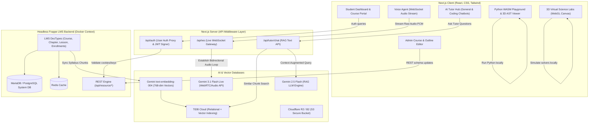

# Vyomanta LMS Platform - Project Technical Analysis

Welcome to the **Vyomanta LMS & AI Platform** architectural analysis. Vyomanta is a decoupled, high-performance, AI-native Learning Management System (LMS) designed for modern scientific and computer science education. It integrates client-side WebAssembly execution, real-time 3D graphics, low-latency audio streaming, and secure multi-tenant Retrieval-Augmented Generation (RAG) on a distributed cloud topology.

---

## 🏗️ 1. System Architecture & Component Mapping

The system follows a modern, decoupled **headless architecture** separated into an interactive client layer, an API orchestration middleware gateway, and a containerized data storage/management tier.



---

## 🛠️ 2. Core Technologies & Services Stack

The system utilizes an advanced matrix of cloud-native and client-side runtimes:

1. **Frontend Core**: **Next.js (v14.2.5)** with App Router. Next.js handles server-side rendering (SSR) exclusions dynamically to safely bundle browser-only environments.
2. **Interactive 3D Graphics**: **Three.js** utilizing rendering loops, camera projection systems, and mouse-bound raycasters to model lab gear, physical structures, and memory maps.
3. **Sandbox Python Compilation**: **Pyodide WASM (WebAssembly)**, executed inside a dedicated browser Web Worker thread (`pyodide.worker.js`) to provide an isolated compile/run cycle.
4. **Content Management & Admin Controls**: **Headless Frappe LMS** framework, running inside Docker containers with a MariaDB DBMS and a Redis caching server.
5. **Persistent Document & Vector Indexes**: **TiDB Cloud**, supporting relational data mapping together with **HNSW vector indexes** (`idx_embedding` over 768-dimensional columns).
6. **Distributed Conversational Cache**: **Upstash Redis**, providing a sliding-window message history, rate limiters, session stores, and pub/sub channels.
7. **Secure Assets Engine**: **Cloudflare R2 / Backblaze B2** S3-compatible object storage. Access is locked and served exclusively through short-lived (5-minute expiry) pre-signed URLs.

---

## 📋 3. Detailed Features Catalog

Below is a detailed inventory of the core features and modules implemented within the Vyomanta ecosystem:

### Feature 1: Student Dashboard & Learning Portal
* **Daily Learning Streak**: Leverages localStorage and session hooks to track user activity streaks, visualised using dynamic indicators.
* **Daily Concept Flashcards**: Renders interactive, dual-sided cards featuring micro-concepts that flip on hover.
* **Daily Skill Quiz**: Evaluates real-time MCQ skill checks. Answers are validated on-screen with prompt feedback.
* **Interactive Tasks Checklist**: Tracks student goals like "Resume active syllabus", "Ask a question in AI Tutor", and "Review Daily Concept Card".
* **Enrolled Courses Grid**: Renders current enrollments with dynamic progress bars based on completed lessons.

### Feature 2: Course Outline & Syllabus Editor (Admin Console)
* **Visual Tree Outline Editor**: Allows administrators to organize courses into Chapters and Lessons.
* **Frappe REST Sync Engine**: Translates admin updates into REST queries, instantly synchronizing structures with backend MariaDB tables.
* **Lesson Content Manager**: Supports attachments, URLs, read times, and quizzes for each lesson page.

### Feature 3: Interactive 3D Science Simulator Labs
The Virtual Labs operate inside a responsive split-pane layout. Parameter controllers adjust variables in real-time, driving custom equations simulated inside a WebGL loop.

#### A. Physics Simulation Labs
* **Simple Pendulum Lab**: Solves $\frac{d^2\theta}{dt^2} + \frac{g}{L}\sin\theta + c\frac{d\theta}{dt} = 0$ using Euler integration. Renders red-sphere bobs and dynamically drawn lines. Includes visual force vectors showing velocity (green) and acceleration (red) via `THREE.ArrowHelper`.
* **Projectile Motion Lab**: Solves parabolic kinematics ($x(t) = v \cos\theta \cdot t$, $y(t) = y_{\text{muzzle}} + v \sin\theta \cdot t - \frac{1}{2}g t^2$) over time. Renders rotating cylinders for the cannon barrel and tracks path trails with `THREE.Line`.
* **Reflection & Refraction Lab**: Evaluates Snell's Law ($\sin\theta_2 = \frac{n_1 \sin\theta_1}{n_2}$). Computes light paths and handles Total Internal Reflection (TIR) calculations dynamically.
* **Spring-Mass System**: Solves damped harmonic oscillations ($\frac{d^2y}{dt^2} + \frac{c}{M}\frac{dy}{dt} + \frac{k}{M}y = 0$). Renders helical springs using `THREE.TubeGeometry` that scale dynamically.
* **Ohm's Law Circuit**: Renders 3D resistors, batteries, and wires. Visualizes electronic current flow by translating glowing spheres along coordinates at speeds proportional to $I = \frac{V}{R}$.

#### B. Chemistry Simulation Labs
* **Atomic Bohr Builder**: Renders clusters of protons and neutrons in the nucleus. Animates electrons revolving around orbital rings at speeds inversely proportional to orbital radius.
* **Gas Laws (PV=nRT) Chamber**: Renders a glass container containing bouncing spheres (molecules). The piston lid translates vertically to match Volume ($V$), and molecules accelerate based on Temperature ($T$).
* **Acid-Base Titration**: Implements pH calculation ($pH = -\log_{10}[H^+]$). Drops base indicator fluid from a virtual buret, blending conical flask liquid from transparent to bright magenta pink when $pH > 8.2$.
* **Molecular Gas Diffusion**: Separates particles with a sliding partition. Once opened, particles diffuse between chambers based on Root-Mean-Square speed ($v_{\text{rms}} = \sqrt{\frac{3RT}{M_w}}$).
* **Periodic Table Trends**: Visualizes atomic properties (radius, electronegativity) by scaling and color-coding selected elements in a 3D interface.

#### C. Biology Simulation Labs
* **3D Animal Cell Organelles Explorer**: Renders 3D structures of core organelles (Nucleus, Mitochondria, ER, Golgi, Lysosomes). Implements Three.js `Raycaster` to detect clicks, scale organelles with pulsing animations, and display context cards.
* **Ecosystem Food Web**: Simulates predator-prey populations (Plants, Rabbits, Foxes) using Lotka-Volterra differential equations:
  $$\frac{dP}{dt} = \alpha P - \beta P R, \quad \frac{dR}{dt} = \delta P R - \gamma R - \epsilon R F, \quad \frac{dF}{dt} = \eta R F - \theta F$$
  Renders a dynamic 3D landscape with hopping rabbits and running foxes, paired with a real-time SVG line chart.

### Feature 4: General AI Tutor Hub
* **Multi-Mode Scaffolding**: Adjusts response style depending on the selected mode:
  * *Beginner*: Uses basic definitions and analogies.
  * *Exam*: Focuses on syllabus objectives, mark distribution, and key terms.
  * *Interview*: Prioritizes logical flow, quick recaps, and potential mock questions.
  * *Revision*: Provides brief bulleted summaries.
* **Flexible Detail Slider**: Controls context depth (Short, Medium, Deep).
* **Interactive Tooling Shortcuts**:
  * *Quiz*: Triggers the LLM to write a custom interactive quiz based on the conversation topic.
  * *Flashcards*: Assembles interactive study decks.
  * *Visual Summary*: Groups key concepts into structured markdown tables.
  * *Explain Simpler*: Prompts the tutor to explain the topic with simpler words and physical analogies.

### Feature 5: AI Coding Tutor
* **Syntax & Logical Debugger**: Identifies syntax issues in student code and suggests structural fixes.
* **Style Optimizer**: Recommends standard styling patterns (e.g. PEP 8 rules for Python).
* **Workspace Chat Integration**: Allows students to share their active sandbox code files directly with the AI model for review.

### Feature 6: WASM Python Playground & 3D Code Visualizer
* **Client-Side WASM Compiler**: Pyodide runs Python in a sandboxed Web Worker, preventing server overload and execution delays.
* **Integrated Terminal Emulator**: Integrates `xterm.js` to pipe script inputs and outputs.
* **3D Memory & Code Flow Visualizer**: Maps variables, lists, dictionaries, and variable swaps inside a persistent 3D Three.js canvas. Visualizes array sorting, pointer swaps, and stack frame allocations in real-time.

### Feature 7: Voice AI Agent
* **Low-Latency Audio Connection**: Uses Next.js WebSocket wrappers to build a pipeline to Gemini 3.1 Flash Live.
* **Speech-to-Speech Loop**: Streams PCM audio base64 buffers directly, avoiding intermediate text delays.
* **Real-time Sentiment Adjuster**: Scans transcripts for signs of frustration or confusion. If detected, it updates system instructions to speak slower, simplify language, and introduce physical analogies.

### Feature 8: Secure Multi-Tenant Document Ingestion & RAG
* **Upload Ingestion Validation**: Implements rate limits, file size checks (<10MB), and page caps (<50 pages) before queuing files.
* **Cloudflare R2 Storage**: Uploads PDF streams directly to a secure, private bucket.
* **Background Ingestion Workers**: Processes ingestion queues on Render. Worker nodes extract PDF text, split it into 1000-character chunks (with 200-character overlap), generate embeddings using Gemini `text-embedding-004`, and store records in TiDB.
* **Row-Level Security (RLS) & Tenant Isolation**: Implements a centralized service that validates user permissions in Redis before querying vector tables. Ensures students can search only their own sessions and tenants.

### Feature 9: Student Progress Analytics
* **Performance Overview Charts**: Plots course completions, quizzes passed, and study hours.
* **Learning Goals tracker**: Tracks goals and displays historical trends.

### Feature 10: Resource Hub
* **Interactive Cheat Sheets**: Provides syntax lookup guides for languages like Python, JavaScript, and HTML/CSS.
* **DSA Library**: A categorized repository of Data Structures and Algorithms resources.
* **Company-Wise DSA Preparation**: Compiles interview problem indexes from major tech companies.
* **Markdown Cheat Sheet**: Features a dual-pane editor with live markdown rendering.

---

## 📈 4. Technical Workflows

### A. Document Upload & Ingestion Pipeline
```
[User Browser] --(1. PDF File + JWT Header)--> [Next.js API Gateway (Vercel)]
                                                     |
                                            (Validate Limits & Cap)
                                                     |
                                   +-----------------+-----------------+
                                   |                                   |
                  (2. Push File to Private Bucket)       (3. Register Queue Task)
                                   v                                   v
                         [Cloudflare R2 Bucket]            [TiDB Queue Table]
                                                                       |
                                                           (4. Worker Lock Row)
                                                                       v
                                                           [Render Queue Worker]
                                                                       |
                                                           (5. Run PDF Parser)
                                                                       |
                                                           (6. Text Chunking)
                                                                       |
                                                      (7. Generate 768-dim Vectors)
                                                                       v
                                                           [Gemini Embeddings API]
                                                                       |
                                                           (8. Bulk Insert Records)
                                                                       v
                                                           [TiDB Vector Table]
                                                                       |
                                                           (9. Publish SSE Event)
                                                                       v
[User Browser] <--(10. SSE Status Push)-- [Next.js SSE Stream] <-- [Upstash Redis Pub/Sub]
```

### B. Secure RAG Query Execution with RLS
```
[Student Chat UI] --(1. Ask Question + JWT)--> [Next.js Tutor Route]
                                                      |
                                           (2. Call Embeddings API)
                                                      v
                                            [Gemini Embeddings]
                                                      | (768-dim Vector)
                                                      v
[Next.js Tutor Route] --(3. Fetch Matched Chunks + Vector)--> [Centralized RLS API (Render)]
                                                                    |
                                                          (4. Check Permissions)
                                                                    v
                                                          [Upstash Redis Cache]
                                                                    | (Validate Tenant/Course ID)
                                                                    v
                                                          (5. Execute Vector Query)
                                                                    v
                                                            [TiDB Cloud DB]
                                                                    |
                                                          (6. Return Filtered Rows)
                                                                    v
[Next.js Tutor Route] <--(7. Return Checked Chunks)--------------- RLS API
          |
 (8. Prompt Construction)
          |
 (9. Stream Answer)
          v
[Student Chat UI]
```

### C. Live Voice Agent Streaming loop
```
[User Microphone] --(1. Raw PCM audio chunk)--> [Browser WebClient]
                                                       |
                                            (Base64 JSON Wrap)
                                                       v
                                            [Next.js WebSocket Proxy]
                                                       |
                                            (2. Validate Connection Ticket)
                                                       v
                                            [Voice Server (Render)]
                                                       |
                                            (3. Establish Live loop)
                                                       v
                                            [Gemini Live API]
                                                       |
                                            (4. Real-time audio stream)
                                                       v
[User Speaker] <--(5. Play Audio PCM Buffer)-- [Voice Server (Render)]
```

---

## 📂 5. Workspace Directory Layout

```
Vyomanta Workspace/
├── backend/                      # Containerized Python background tasks & helpers
│   ├── queue_worker.py           # Background task processing for PDF parsing & indexing
│   ├── test_rag_rls.py           # Verification and integration testing suite for RLS
│   ├── create_students.py        # Seed script for LMS student profile mock structures
│   ├── patch_api.py              # System APIs customization hooks
│   └── Dockerfile.render         # Deployment configuration for internal services
├── frontend/                     # Next.js frontend repository
│   ├── app/                      # Next.js App Router (pages and api routes)
│   │   ├── admin/                # Admin Panel views for course outline editing
│   │   ├── api/                  # Server-side route handlers (tutor, progress, files)
│   │   ├── coding-tutor/         # AI Code assistant interface
│   │   ├── general-tutor/        # AI General assistant chatroom
│   │   ├── labs/                 # Split-pane 3D Virtual Science Simulator page
│   │   ├── playground/           # WebAssembly code playground route
│   │   └── resources/            # Cheat sheets, DSA library, and markdown editor
│   ├── components/               # UI components library
│   │   ├── labs/                 # Three.js labs modules (PhysicsLab, ChemistryLab, BiologyLab)
│   │   ├── voice-tutor/          # WebSocket voice assistant panel and canvas robot visualizer
│   │   ├── CodeVisualizer3D.jsx  # Three.js execution flow memory visualizer
│   │   └── Playground.jsx        # Codemirror IDE editor with WASM worker interfaces
│   ├── hooks/                    # Reusable custom React hooks
│   │   └── usePyodide.js         # WASM Web Worker loader, starter, and code tracer hook
│   └── lib/                      # Database connectors, caching keys, and datasets
└── docs/                         # Additional playground design records and details
```
